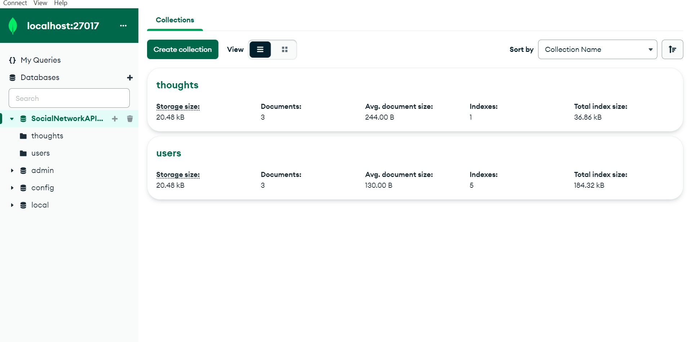
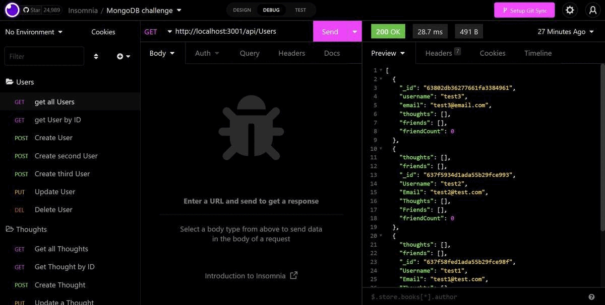

# 
 🏷️**social-network-api-nosql-mongodb** 

---

## 
 _Description_ 📝

Building an API for a social network web application where users can share their thoughts, react to friends’ thoughts, and create a friend list. Using express, mongodb and mongoose odm.

## 
 _Languages Used_ 💬

Javascript, Express.js, MongoDB, Mongoose ODM.

---

## _Table of Contents📖_

- [Installation](#Installation)💾
- [Usage](#Usage)🖥
- [Links](#Links)📎
- [Credits](#Credits)💳
- [Licence](#License)🪪
- [Badges](#Badges)🦡
- [Questions](#Questions)❓
- [Contribution](#Contribution)➕
- [Tests](#Tests)🧪

---

## _Installation💾_

- Git clone this repo.

- `npm i` in terminal>`npm run watch` to start server.
  

- install insomnia to view and test all routes. And MongoDB compass along with mongod and mongoose to run the database.
  

  

## _Usage🖥_

- In insomnia create `GET, POST, PUT & DELETE` routes for the **users, thoughts reactions and friends** to test and verify them out . Please have a look at this [walkthrough video](https://drive.google.com/file/d/1i6NbuXKiG2XsqKrGNuEvuFCG6cwE-iPU/view "length: 12 mins") for the same.

## _Links📎_

Click for Github repo and deployed Links

- <https://github.com/A-N26/NoSQL-SocialNetworkAPI-MongoDB>

- No deployment for this project.

## _Credits💳_

Google&YouTube, in-class sessions and askBCS.

## _License🪪🦡_

(**Please Click the BADGE for the license details.**)

## _Badges🦡_

    

## _Questions❓_

If you would like to as me anything (ama) about the project, please contact me on the info mentioned below:

Contact Me✉️

- My GitHub Profile - [A-N26](https://github.com/A-N26)

- e-mail - [📧](A-N26@github.com)

## _Contribution➕_

Please do not hesitate to fork this repo. And, there-after, create a new branch and commit, push that branch and create a pull request.☻

## _Tests🧪_

No tests implemented atm...
